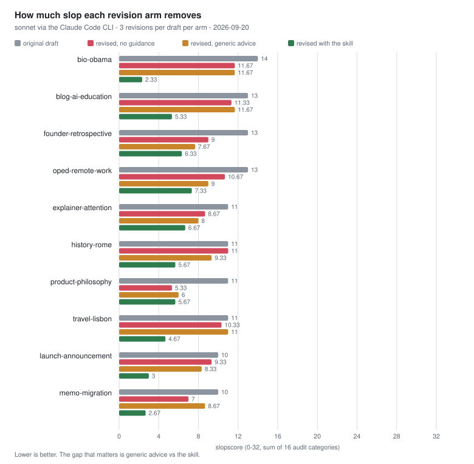
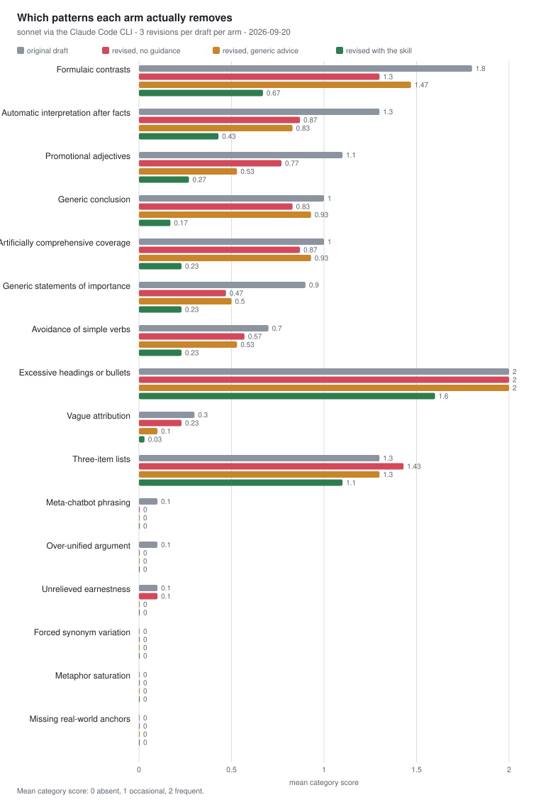

# Less AI-Like Writing Skill

[](https://github.com/tonyexpo/the-less-ai-like-writing-skill/actions/workflows/ci.yml)
[](https://github.com/tonyexpo/the-less-ai-like-writing-skill/actions/workflows/eval.yml)
[](LICENSE)
[](https://github.com/tonyexpo/the-less-ai-like-writing-skill/commits/main)
[](https://github.com/tonyexpo/the-less-ai-like-writing-skill/stargazers)

A reusable writing and editing skill that reduces common generic LLM prose patterns while preserving clarity, factual accuracy, and the author's natural voice.

It is designed for text that feels too polished, vague, repetitive, promotional, or structurally predictable. The goal is better writing—not manufactured imperfections or tricks intended to defeat AI detectors.

## Sources

The skill's pattern catalog is not folk wisdom. It draws on two sources, in this order:

1. **[Wikipedia:Signs of AI writing](https://en.wikipedia.org/wiki/Wikipedia:Signs_of_AI_writing)** — the English Wikipedia community's own essay cataloguing recurring tells in AI-generated prose (em dashes used as formulaic emphasis, the compulsive rule of three, "not only X but also Y" symmetry, boosterish language, and more), compiled from thousands of real edits its editors have reviewed. The original twelve categories in the audit below are this project's attempt to turn that essay into something a test suite can check.
2. **[StoryScope (Russell et al., arXiv:2604.03136)](https://arxiv.org/abs/2604.03136)** — a 2026 study that induces 304 narrative features from ~61,600 parallel human- and LLM-written stories and finds AI fiction separable from human fiction mainly by narrative architecture (93.2% macro-F1 from structure alone, no surface style). Four of that paper's findings that plausibly transfer from fiction to ordinary prose became categories 13–16: metaphor saturation, missing real-world anchors, over-unified arguments, and unrelieved earnestness. Two findings from the same paper explicitly did **not** become detectors — raw em-dash frequency and sentence length barely separate AI from human text in its data (and sentence fragments actually run the opposite direction from folk wisdom) — and `tools/patterns.py` documents why, so the omission does not get quietly reintroduced later.

## What it improves

The skill looks for patterns such as:

- abstract claims of importance without supporting facts;
- unnecessary interpretation after every statement;
- promotional or brochure-like language;
- forced contrasts and three-part lists;
- synonym cycling where simple repetition would be clearer;
- overly elaborate verbs, headings, introductions, and conclusions;
- vague attribution and assistant-style filler;
- sustained metaphor, missing real-world anchors, over-unified arguments, and unrelieved earnestness.

It then favors concrete details, simple accurate verbs, natural rhythm, selective explanation, and a voice suited to the author and context.

### Small example

**Generic LLM-style prose**

> This development highlights the crucial role of technology in an ever-evolving digital landscape.

**More specific prose**

> The update cuts export time from 12 minutes to about 7.

The revision does not try to sound human by adding mistakes. It replaces a generic claim with the fact that makes the change worth mentioning.

## Download and use

This repository *is* the skill: `SKILL.md` sits at the repository root, in the standard Claude Skill format (YAML frontmatter with `name` and `description`, followed by the instructions).

### Claude Code / Claude apps that support Skills

Clone (or add as a git submodule) directly into your skills folder, keeping the repository name as the skill's folder name:

```sh
git clone https://github.com/tonyexpo/the-less-ai-like-writing-skill.git .claude/skills/the-less-ai-like-writing-skill
```

Claude will pick it up automatically based on the `description` in the frontmatter.

### Claude/ChatGPT or others

[](https://github.com/tonyexpo/the-less-ai-like-writing-skill/raw/refs/heads/main/SKILL.md)

1. Download the file above (or [`SKILL.md`](https://github.com/tonyexpo/the-less-ai-like-writing-skill/raw/refs/heads/main/SKILL.md) directly).
2. Upload it to ChatGPT, Claude, or another AI tool that accepts instruction files or project attachments.
3. Ask the tool to apply the skill when drafting or revising text.

Example requests:

> Use the attached skill to rewrite this draft. Keep my meaning and tone, but make the prose more direct and less generically AI-like.

> Edit this article using the attached skill. Preserve the technical terminology and remove rhetorical padding.

> Draft a concise announcement using the attached skill. Do not add claims or details that I have not provided.

## Does it work?

Measured, not asserted. Ten AI-slop drafts are revised three times each under
three conditions that differ only in the system prompt, and the revisions are
scored by [`tools/slopscore.py`](tools/slopscore.py) against the sixteen-category
audit in `SKILL.md` (0-32, lower is better).

The middle arm is the one that makes this worth reading. Comparing the skill
against an empty prompt would only show that a long instruction beats none, so
a third arm gets a short paragraph of ordinary copy-editing advice instead.

| condition | slopscore | hits per 100 words |
| --- | ---: | ---: |
| the original drafts | 11.70 | 6.48 |
| revised, no guidance | 9.43 | 5.82 |
| revised, generic writing advice | 9.13 | 6.06 |
| **revised with this skill** | **4.97** | **3.76** |

Generic advice removes almost nothing (11.70 to 9.13). The skill removes about
five times as much, and the gap between the two — 4.16 points of score, 2.30
hits per 100 words — is the part attributable to the skill rather than to
prompting in general.

<picture>
  <source media="(prefers-color-scheme: dark)" srcset="assets/slopscore-by-draft-dark.svg">
  
</picture>

<picture>
  <source media="(prefers-color-scheme: dark)" srcset="assets/slopscore-by-category-dark.svg">
  
</picture>

### Read the numbers with these caveats

- **Part of the gain is length.** The skill's revisions are shorter (254 words
  against 332 unguided), and shorter text trips fewer patterns outright. Cutting
  padding is one of the skill's stated goals, so this is not cheating, but it
  does mean the honest margin over generic advice is 4.16 points of score and
  2.30 hits per 100 words - the smaller number is the length-adjusted one.
- **Structure survives every arm.** "Excessive headings or bullets" barely moves
  (2.00 to 1.60): asked to revise, the model rewrites sentences and leaves the
  scaffolding alone more than it should. If a draft is over-structured, the
  skill will not fix that by itself.
- **Two detectors are inert on this corpus.** "Forced synonym variation" and
  "Metaphor saturation" scored 0 everywhere across all 90 revisions.
  "Missing real-world anchors" and "Over-unified argument" scored at most
  0.10. These four are narrow lexical proxies for whole-document judgments
  from a 2026 fiction study (see Sources, above) and are validated at the
  unit-test level, but this particular eval corpus - mostly explainer,
  marketing, and technical genres - is not the right stimulus to exercise
  them at scale. Treat those four rows as unmeasured here, not as evidence
  the patterns don't occur; [`evals/README.md`](evals/README.md) has the
  detail, including the one case where a frozen draft *did* trip two of
  them before revision washed the signal back out.
- **The harness is not a clean model.** Everything runs through the Claude Code
  CLI, which adds a system prompt of its own to all three arms. They are
  compared under identical conditions, but none of them is a raw model.
- **Small n**, one model, English only. Ten drafts, three samples per arm.

Full method, the confounds behind these choices, and how to reproduce:
[`evals/README.md`](evals/README.md).

## The scorer

`tools/slopscore.py` turns the audit in `SKILL.md` into something a test can
assert on. No dependencies.

```sh
python -m tools.slopscore draft.md            # a report with line-level evidence
python -m tools.slopscore --json draft.md     # machine-readable
cat draft.md | python -m tools.slopscore -    # from a pipe
python -m tools.slopscore --max-score 7 *.md  # exit 1 above the threshold
```

It scores each of the sixteen categories 0 (absent), 1 (occasional) or 2
(frequent), using the bands the skill already defines: 0-7 low, 8-15 revise,
16+ substantial rewrite.

It is a writing heuristic, not an AI detector, and it does not read minds: it
counts surface patterns. A text can score 0 and still be boring, wrong, or
plagiarised. What it will not do is reward the tactics `SKILL.md` forbids -
there are tests asserting that em dashes, contractions, correct spelling and
honest repetition all cost nothing.

## Development

```sh
pip install -r requirements-dev.txt
python -m pytest            # scorer, CLI, corpus and SKILL.md contract tests
ruff check . && ruff format --check .
```

CI runs the suite on Python 3.10 to 3.13 on every push. The live model eval is a
separate workflow: it needs an `ANTHROPIC_API_KEY` secret, runs weekly, and
fails if the skill stops beating the generic-advice arm.

One test is worth knowing about: `tests/test_skill_contract.py` asserts that the
sixteen categories in the `SKILL.md` audit match the scorer's, in the same order,
and that the prose band thresholds match the `BANDS` cutoffs in code.
Add a category to the skill without teaching the scorer about it and the build
goes red instead of quietly under-reporting.

## What the skill does not do

The skill does not deliberately insert spelling mistakes, awkward grammar, random slang, fake anecdotes, or fabricated sources. It does not ban individual words or punctuation marks mechanically.

It also does not guarantee that a text will pass an AI detector. Detector results are unreliable, and no stylistic process can guarantee a particular classification. This skill focuses on writing quality rather than detector evasion.

## Guiding principle

The target is not imperfect writing. The target is writing that is specific, proportionate, purposeful, and recognizably authored.

## License

Distributed under the [Apache License 2.0](LICENSE).
